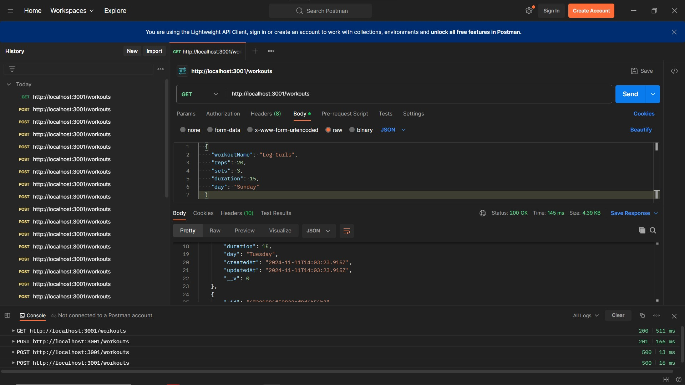

# Mendoza-JR-A3

## Flutter Project with Integrated NestJS Backend and MongoDB Database

### Flutter

- **Port**: 0529 or 529
- **URL**: `http://localhost:529`

### NestJS

- **API URL**: http://localhost:3001/workouts

### Installation and Setup

1. Clone the repository:
   git clone https://github.com/IT3105/Mendoza-JR-A3

2. Install dependencies for NestJS: In the NestJS folder, run:
   npm install

3. Install Flutter dependencies: In the Flutter project folder, run:
   flutter pub get

### Run the backend (NestJS): Follow the instructions below to start the backend API.

### To RUN NestJS:

1. Navigate to the NestJS folder inside the Flutter project folder:
   cd NestJS Folder within Flutter Project Folder
   Run the NestJS server:
   npm run start

### Run the frontend (Flutter): Follow the instructions below to run the Flutter app.

### To RUN Flutter:

1. Navigate to the Flutter project folder:
   cd Flutter Project Folder
   Run the Flutter app on Edge with custom port 529:
   flutter run -d edge --web-port=529

#### Key Points:

Add: Works well in Home Page, List View, and Grid View.

Edit: Works in List View and Grid View; however, the Home Page needs a refresh to reflect changes.

Delete: Works but requires a refresh across all views to see the changes.

Backend: Connects well with MongoDB database and handles CRUD operations.

UI: Some UI-related and fetching issues may occur during interaction.

Additonal: Postman Works, Tested All CRUD Functions

#### Known Issues:

Delete Operation:
Works, but an error prompt appears. Simply click OK to continue. A page refresh is needed for the UI to update correctly.

Home Page:
The total workout count works correctly for Delete and Edit, but requires a page refresh for the data to be properly updated in the UI.

#### Conclusion

This project allows you to manage workouts efficiently with a Flutter frontend and NestJS backend, connected to a MongoDB database. It is still a work in progress with some known issues related to UI fetching and page refresh behavior.

#### Sample Testing Photos

### GRADE

- the nest js project isnt included in the flutter project, i trust your screenshots
- Functionality & Features (20/20)
  Code Quality & Best Practices (20/20)
  Implementation of Development Tools (15/15)
  User Interface (UI) & User Experience (UX) (15/15)
  Use of Libraries/Frameworks (20/20)
  Task Completion & Time Management (2/10)
  TOTAL 92
